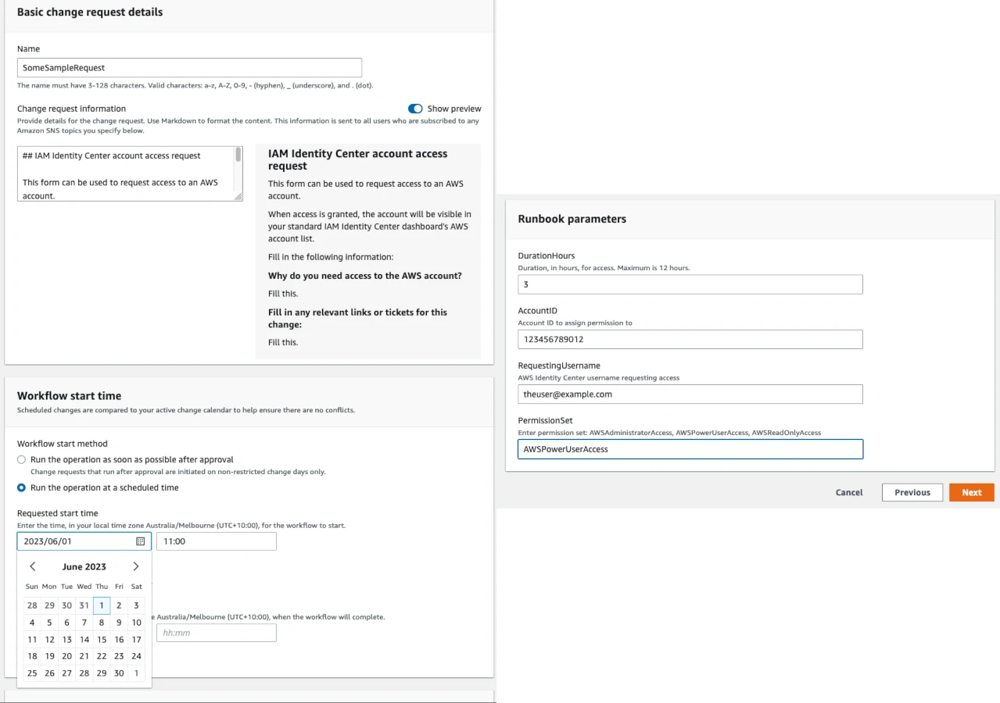
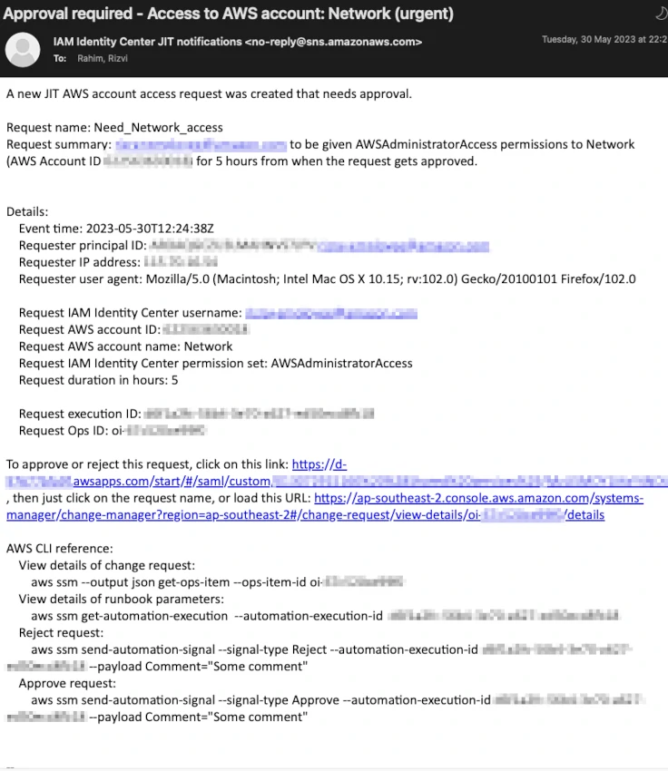
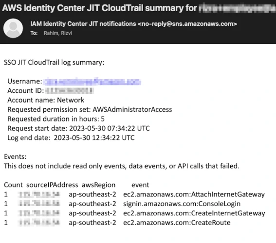
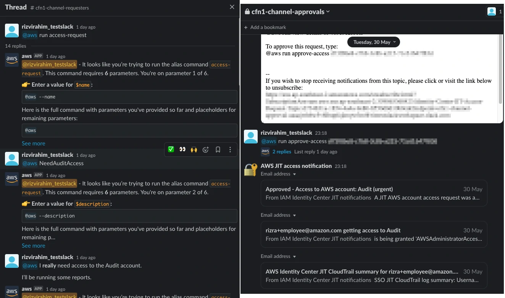
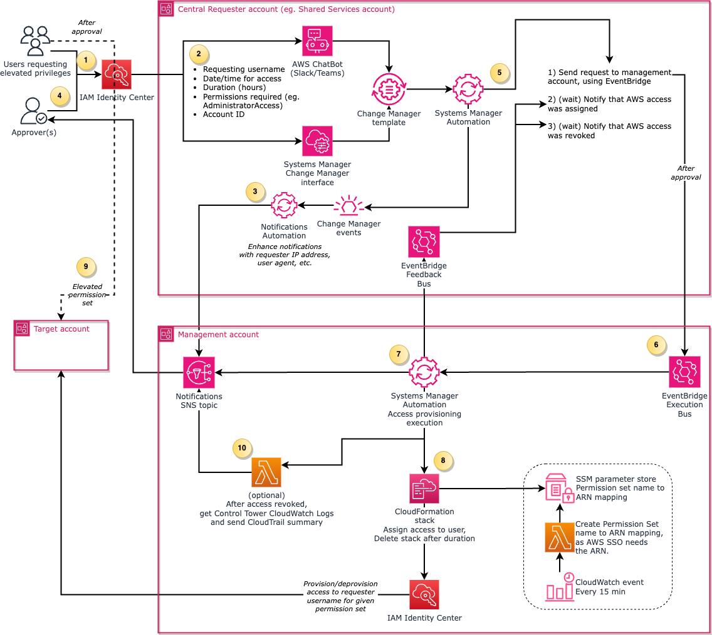
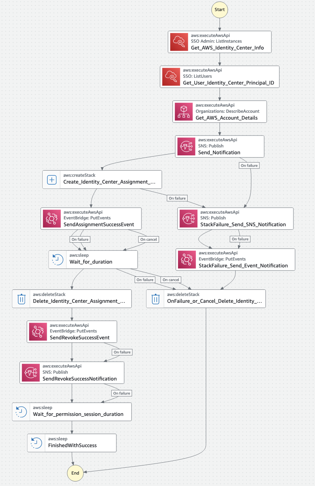

# Requesting just-in-time privileged access to AWS using managed services

This is a sample of how you can use AWS managed services, specifically [AWS Systems Manager Change Manager](https://docs.aws.amazon.com/systems-manager/latest/userguide/change-manager.html) and [AWS Systems Manager Automation](https://docs.aws.amazon.com/systems-manager/latest/userguide/systems-manager-automation.html), and optionally [AWS Chatbot](https://aws.amazon.com/chatbot/), to request Just-in-Time (JIT) privileged access to AWS accounts via [AWS IAM Identity Center](https://aws.amazon.com/iam/identity-center/). 

For a more fully fledged open source option for just-in-time access to AWS accounts, consider using the [Temporary elevated access management (TEAM) for AWS IAM Identity Center](https://aws.amazon.com/blogs/security/temporary-elevated-access-management-with-iam-identity-center/) instead of this repo. TEAM is the recommended option for configuring just-in-time access. However, the solution in this repo differs from TEAM in that:

- This solution uses a managed service, [AWS Systems Manager Change Manager](https://docs.aws.amazon.com/systems-manager/latest/userguide/change-manager.html), as the web interface to raise requests. TEAM uses a custom purpose built web interface.
- This solution is simpler overall, with only 2 [AWS CloudFormation](https://aws.amazon.com/cloudformation/) template files, whereas TEAM has over 180 code files and has more features.
- This solution avoids the use of custom code in [AWS Lambda](https://aws.amazon.com/lambda/) whenever possible to avoid code maintenance, by making use of  [AWS Systems Manager Automation](https://docs.aws.amazon.com/systems-manager/latest/userguide/systems-manager-automation.html). There are only 2 Lambda functions in this repo, one of which one is optional, and the other being a scheduled job outside the request flow. 
- This solution does not use any third party dependencies, whereas TEAM [has a few](https://github.com/aws-samples/iam-identity-center-team/blob/main/package.json).
- This solution supports raising and approving requests via a Chat interface (Slack/Teams) using [AWS Chatbot](https://aws.amazon.com/chatbot/), whereas as of writing, TEAM only supports sending chat notifications.

### Intro

This solution demonstrates a system where users can request Just-in-Time (JIT) privileged access to AWS accounts which, for customers already using [AWS IAM Identity Center](https://aws.amazon.com/iam/identity-center/) (successor to AWS Single Sign-On/SSO) using any [supported identity provider](https://docs.aws.amazon.com/singlesignon/latest/userguide/supported-idps.html). It uses AWS Systems Manager's [Change Manager](https://docs.aws.amazon.com/systems-manager/latest/userguide/change-manager.html) for approval management. It optionally can use [AWS Chatbot](https://aws.amazon.com/chatbot/) for requesting and approving access requests in Teams or Slack instead.

Users log into a central requester account via IAM Identity Center, and can select the time and duration required for their access via a Systems Manager Change Manager form, and the AWS account they need to access, the duration, permission set required:
 

An email is then sent to the approver group SNS topic, notifying that there is an approval pending:

'N' number of members (configurable via the stack parameters, defaults to 1) of an approver IAM Identity Center group can click on the link in the email, and log in via IAM Identity Center, view the details, and approve or deny the request. Users cannot approve requests they raised themselves. Once approved, a notification is sent to the SNS topic similar to the above of the approving principal's ID, IP address and user agent. In the start time, the user is granted temporary access for the duration requested using IAM Identity Center, and a notification sent to the SNS topic. If Control Tower is enabled, then after the access is removed, a summary of CloudTrail non-readonly events can be sent to the approver group email as well:

Alternatively, AWS Chatbot can be used to raise and approve requests using Slack _(Pro or higher required for email notification integration)_, or Teams:

This is not intended to be a replacement for the considerably more featureful privileged access management solutions but rather a simple way to get started with basic JIT access using AWS IAM Identity Center and Change Manager. It is entirely serverless, and you are only charged per request.

Any custom code using Python/NodeJS/etc using AWS Lambda was cut to a minimum. If sending a CloudTrail summary is disabled, the entire request flow does not use AWS Lambda or any programming languages, which reduces the code maintenance required. Everything in the request flow, except for sending the CloudTrail summary, is implemented using pure Systems Manager Automation documents in YAML. The only other Lambda function is a scheduled process that keeps the Permission Set name to ARN mapping in SSM, and this takes no input payload, and runs outside the request flow. None of the Lambda functions included depend on any third party libraries outside the ones included with the default Lambda Python runtime.

Make sure you audit the code and design, to validate that it complies with your security standards, before using this CloudFormation template.

## Base Installation

### Requirements

- You need to have AWS Organizations set up with AWS IAM Identity Center already configured and actively used by users to log into AWS. IAM Identity Center can be configured to use any [identity provider](https://docs.aws.amazon.com/singlesignon/latest/userguide/supported-idps.html).

- You will need to designate a "requester" AWS account that will host the Change Manager request form. This can be an existing AWS account where Change Manager is not already being used (for example some type of shared services AWS account), or a new AWS account with no other workloads. Note down the account ID for the installation steps.

- You have to decide if you will be using the Web interface or CLI script to raise/approve access requests, or whether you will use the ChatBot interface. You cannot have both simultaneously.

- If using the AWS Chatbot mode, then the additional requirements are:
- - If using Slack, the Pro or higher subscription is required for email notification integration. You will need to get the email address associated with the chat channel. See instructions for [Slack](https://slack.com/help/articles/206819278-Send-emails-to-Slack#h_01F4WDZG8RTCTNAMR4KJ7D419V) or [Teams](https://support.microsoft.com/en-us/office/send-an-email-to-a-channel-in-microsoft-teams-d91db004-d9d7-4a47-82e6-fb1b16dfd51e).

### Management account

The management account CloudFormation template hosts the Event Bus, which calls the System Manager document that does the actual IAM Identity Center assignment. This step is required for either the web interface option or the Chatbot option.

1. Log into the Management (billing) AWS account. Switch to the region that IAM Identity Center was initialized in.

1. In IAM Identity Center, or your identity provider integrated with IAM Identity Center, you need one user group (either an existing one, or a new one) that would contain the users who can approve requests. Select the group in IAM Identity Center, and under General Information, note down the Group ID for later (in the format _abcdef1234-bcdefa2345-..._).

1. Create a CloudFormation stack using the template [IAM-Identity-Center-JIT-access-with-SSM-Management-Account.yaml](IAM-Identity-Center-JIT-access-with-SSM-Management-Account.yaml) with the stack name SSM-IDC-JIT-access-executor (or any name). Read the description of each parameter, and set the values accordingly. The only required values are the Stack Name, **Requester AWS Account ID**, comma separated **IAM Identity Center Permission Sets** that users can request, and **IAM Identity Center Instance ARN**. The instance ARN can be copied from the IAM Identity Center Settings page. _If you deleted the stack and recreated it, set the parameter "Add AWS Organizations Resource Policy" under "Advanced Configuration" to "No"._

1. After that CloudFormation stack is created, there will be three new IAM Identity Center permission sets, `ApproveAWSAccountAccess`, `RequestAWSAccountAccess` and `RequestAccountAccessNoApproval`. Assign your designated IAM Identity Center user group the `ApproveAWSAccountAccess` permission set to the requester AWS account. Assign `RequestAWSAccountAccess` to groups or users that would raise requests to that requester AWS account as well. To do this, go to the management account -> IAM Identity Center -> AWS accounts, and select the requester AWS account. Click on Assign users or groups, select the group, and then select the `RequestAWSAccountAccess` (if the user will be requesting access only), or the `ApproveAWSAccountAccess` permission set. Make sure both permission sets are assigned to the appropriate group for the requester account. Do not assign access to other AWS accounts to either of these permission sets. You will not be able to proceed to the next steps until this is done. Administrator access is not sufficient to approve the requests. 

## Web interface/CLI option 

For the Chatbot option, skip to the **Chatbot option** section below.

### Installation - requester account (Web interface/CLI option)

The requester account CloudFormation template hosts the user facing form to request access, which runs the SSM execution that sends the request to the management account's Event Bus.

1. Log into your requester AWS account with Administrator or sufficient privileges, in the same region as the IAM Identity Center region.

1. Go to the Systems Manager service, and then [Change Manager](https://console.aws.amazon.com/systems-manager/change-manager) on the left. 

1. If this is the first time accessing Change Manager, follow the link to "Set up" change manager, and after that click on the "skip" button on top. 

1. Go to the Change Manager's Settings tab, and click on Edit.

1. Under _"User identity management"_, select AWS Select Sign-On (SSO). Do not make any changes to the Template reviewer notification.

1. Under _"Best practices"_, Uncheck _"Require template review and approval before use"_ (unless you are already familiar with operating Change Manager, and can approve the template after the request CloudFormation stack is instantiated. The template will have to be approved with every change of the stack.)

1. Go to the CloudFormation service, and create a CloudFormation stack using the template [IAM-Identity-Center-JIT-access-with-SSM-Requester-Account.yaml](IAM-Identity-Center-JIT-access-with-SSM-Requester-Account.yaml), with the stack name "SSM-IDC-JIT-access-requester" (or anything). Read the description of each parameter, and set the values accordingly. The only required values are the Stack Name, Management AWS Account ID, IAM Identity Center Permission Sets (should be the same as the ones in the Management stack), whether you will use the Web/CLI or Chatbot option, and the IAM Identity Center approver group ID.

1. Note down the "ChangeManagerDocumentName" value from the Outputs tab of the CloudFormation stack

1. Log back in the management Account, and click on the _"SSM-IDC-JIT-access-executor"_ stack, and click on Update. Select "Use existing template", and press Next.

1. Under _"Post-installation (after requester stack is created)"_, paste the value of the Output copied earlier. Update the stack.

### Requesting access (Web interface)

You now can log into AWS IAM Identity with a requester account, and click your requester AWS account, and select the RequestAWSAccountAccess or RequestAccountAccessNoApproval permission set. Create a request, and then log into the requester account again with a different user that has ApproveAWSAccountAccess access. Approve the change, and check if the requester now has the requested access. The steps are:

1. Log into the IAM Identity Center portal as you would for accessing AWS accounts.

1. Click on the designated requester account, and then the RequestAWSAccountAccess permission set.

1. Fill in the Name of the request (without spaces, does not have to be unique), and the information about why you need access.

1. Select the Workflow start time (the date/time access you need access, the estimated end date/time is not used), or if you need access immediately select the default of running as soon as possible after approval.

1. Click on Next

1. Scroll down to Runbook parameters, and fill in the Duration Hours, Account ID (if you already have read only access to the account, you can copy the account ID from the IAM Identity Center portal), your IAM Identity Center username, and the Permission Set you need (which you can copy and paste from the description).

1. Click on Next.

1. Click on Submit for Approval.

1. Once access is approved and (if set) the start date/time is reached, refresh the IAM Identity Center portal page, and you should have access to the AWS account with the requested permission set, for the duration specified.

### Approving access (Web interface)

If configured, you should get an email with the subject "Approval required", with a link to the Change request page.

1. Either click on the link in the email, or log into the IAM Identity Center portal as you would for accessing AWS accounts, and click on the designated requester account, and then the ApproveAWSAccountAccess permission set.

1. Under Change requests, select the request that is "Pending approval"

1. Click on Approve or Reject, with an optional message.

### Requesting access (CLI/API)

After making sure the web interface version works, a sample basic Python script is included, [raise-access-request.py](cli-script/raise-access-request.py), demonstrating how you can raise access requests using the command line/boto3. Make sure your AWS CLI profile is configured to use the "RequestAWSAccountAccess" permission set, and run the script. 

Approving access via the CLI can be done via the AWS CLI command included in the approval email.

## Chatbot option

You can either have a shared chat channel for requests and approvals, or separate channels (recommended).

With AWS Chatbot, you can either assign an IAM role to the chat channel itself (called Channel role), or require users to associate their chat identity with an AWS identity (called User role). See [this page](https://docs.aws.amazon.com/chatbot/latest/adminguide/understanding-permissions.html) for more information.

If using User roles, calling `@aws help` in the chat channel would ask the user to click on a link to set up AWS Chatbot. That link needs to be opened after the user logged in with the appropriate permissions set (either requester or approver).

You can mix and match the Channel role and User role, for example using a channel role for raising requests in a request chat channel, and a user role for the approver chat channel (as approving is a more privileged operation).

1. Log into your requester AWS account with Administrator or sufficient privileges, in the same region as the IAM Identity Center region.

1. Go to the Systems Manager service, and then [Change Manager](https://console.aws.amazon.com/systems-manager/change-manager) on the left. 

1. If this is the first time accessing Change Manager, follow the link to "Set up Change Manager". Otherwise, go to the Settings tab, and click on Edit.

1. Under _"User identity management"_, select the User Identity Management setting to be "AWS Identity Access Management (IAM)". Do not make any changes to the Template reviewer notification.

1. Under _"Best practices"_, Uncheck _"Require template review and approval before use"_ (unless you are already familiar with operating Change Manager, and can approve the template after the request CloudFormation stack is instantiated. The template will have to be approved with every change of the stack.)

1. Follow Step 1 of the AWS Chatbot guide for [Slack](https://docs.aws.amazon.com/chatbot/latest/adminguide/slack-setup.html#slack-client-setup) or [Teams](https://docs.aws.amazon.com/chatbot/latest/adminguide/teams-setup.html#teams-client-setup), only up to point 5 (i.e. just the client configuration section, not the channel configuration). Do not configure the channel or SNS topics. 

1. In the AWS Chatbot service page in the AWS Management Console, copy the Workspace ID if you are using Slack, or the Teams ID & Tenant ID if using Teams. 

1. Create your desired chat channel(s) in Slack/Teams for requesting and approving AWS access requests. 

1. Go to the CloudFormation service, and create a CloudFormation stack using the template [IAM-Identity-Center-JIT-access-with-SSM-Requester-Account.yaml](IAM-Identity-Center-JIT-access-with-SSM-Requester-Account.yaml), with the stack name "SSM-IDC-JIT-access-requester" (or anything). Read the description of each parameter, and set the values accordingly.

1. After the stack creation, go to the Outputs tab, and copy the `@aws` commands (chat messages) to the appropriate channels (depending on whether it's for requesting or approving). The first time you enter a `@aws` message, it will ask you to invite @aws to the channel, say yes. If you opted for a User role, the AWS Chatbot will send a message asking you to select an IAM role by clicking on "Let's get started". It will list the account ID with a link. Right click and copy the URL of the link. Then log into the requester account again with the "ApproveAWSAccess" permission set, and paste the URL in your address bar. Select the "Identity-Center-JIT-Access-Chatbot-Approver-Role" or "...-Requester-Role" as needed, and follow the redirection to Slack/Teams to link the accounts. After the accounts are linked, remember to enter the `@aws` commands from the CloudFormation stack Outputs.

1. Note down the "ChangeManagerDocumentName" value from the Outputs tab of the CloudFormation stack.

1. Find out the email address associate with your chat channels (in [Slack Pro and above](https://slack.com/intl/en-au/blog/productivity/email-meet-slack-slack-email), or [Teams](https://support.microsoft.com/en-au/office/send-an-email-to-a-channel-in-teams-d91db004-d9d7-4a47-82e6-fb1b16dfd51e)), and note it down. 

1. Log back in the management Account, and click on the _"SSM-IDC-JIT-access-executor"_ stack, and click on Update. Select "Use existing template", and press Next.

1. Under _"Post-installation (after requester stack is created)"_, paste the value of the ChangeManagerDocumentName output copied earlier. 

1. Under the "Notification emails" section, enter the chat channel email addresses, and the events you want the channels to be notified with. For example, if you have separate requester and approval channels, have at least RequestCreated and CloudTrailSummary in the approver channel, and at least RequestApproved and RequestRejected in the requester channel.

1. After updating the stack, the chat channels should receive an SNS subscription confirmation email. Make sure you confirm the subscription for each email address.

1. Enter a message in the requester chat channel with instructions on how to raise a request, and pin the message. For example:

---

To raise a request to get privileged access to an  AWS account, type:
@aws run access-request
A wizard will open a thread asking for information, respond to each message starting with "@aws":
- **name**: The request title name without spaces, for example Need_access_to_xyz.
- **description**: Freeform text explaining why you need access.
- **hours**: Number of hours you need access for, as a number, for example, 2
- **username**: The full username you use to log into AWS IAM Identity Center.
- **accountid**: The AWS account ID. If you have limited access to the account, you can get the account ID from the IAM Identity Center portal.
- **permissionset**: One of: AWSAdministratorAccess , AWSPowerUserAccess , AWSReadOnlyAccess .

Make sure you start each message with @aws . 

Then click on "Run command".

To raise a request with one message, use this template:

@aws run access-request --name Need_access_to_xyz --description "I need to abc" --accountid 0123456789 --username someone@example.com --hours 2 --permissionset AWSAdministratorAccess

---

To approve a request, the "Approval required" email in the chat channel will have the "@aws" chat command you can copy and paste.

## Notes

- Note that the duration is always extended by the session duration of the IAM Identity Center permission set. This means if the user requests access for 1 hour, and the IAM Identity Center permission set has the default session duration of 1 hour, the access can potentially only be removed after 2 hours (that is, if the user logs in to the account on the 59th minute, the user will have access for the 1 hour session duration of the permission set, totaling 2 hours after the requested start date, before they lose access).

-  If you do not have Control Tower 3+ managing CloudTrail, but want the CloudTrail summary, create an organization CloudTrail on the management account that writes to a CloudWatch Log group, and set that Log Group name in the `CloudTrailCloudWatchLogGroup` Mapping in the management account template file.

- If you have multi level approval requirements (for example, a business approval group and technical approval group), modify the CloudFormation template or the [Change Manager configuration](https://docs.aws.amazon.com/systems-manager/latest/userguide/cm-approvals-templates.html) after the stack is created accordingly.

- In theory, this solution should work with an [IAM Identity Center delegated admin account](https://docs.aws.amazon.com/singlesignon/latest/userguide/delegated-admin.html), however since the major use-case of this solution was centered around just-in-time approved access to sensitive accounts like the management account, this solution was not tested on a delegated admin account, as a deleted admin account cannot assign users access to the management account. In addition, in a Control Tower v3+ environment, the management account contains a CloudWatch Logs group with the organization CloudTrail logs, which is used to send the CloudTrail summary in the end.

## Design

Best practice dictates that users do not log into the Management account directly, hence a second "requester" account is used as the entry point. There are no cross account IAM roles that allows the requester AWS account to run AWS IAM Identity Center commands directly on the management AWS account. Instead, the requester AWS account has permissions to write to an EventBridge bus on the management account, where it can publish a request. This design was chosen (over having a IAM Role trust relationship across accounts) so that someone who was accidentally given Administrator access on the "privileged access requester" AWS account cannot grant access via AWS IAM Identity Center without notifications being sent via SNS that access is being granted.

IAM Identity Center permission assignment is done using CloudFormation instead of the APIs directly. This gives more visibility to active assignments, and allows the management AWS account owners to easily verify the current list of permissions granted, and give confidence that there cannot be persistent IAM Identity Center assignments (for example if there was an unexpected error in the solution that did not revoke access after the duration, which in any case would raise an SNS alert). The description of the CloudFormation stack has a human readable summary of the assignment, for example _"someemployee@example.com AWSAdministratorAccess access to Network for 5 hours"_. Change the "Filter status" in CloudFormation to "Deleted" to see old assignments. 

1. Users log into the "requester" AWS account via a limited AWS IAM Identity Center Permission Set, intending to get privileged access to the target account in the middle left.
2. They fill in a form in the Change Manager interface. The form asks for information like the AWS account ID required, date/time/duration required, permission set, etc. Alternatively, they can also raise the request via an included CLI script, or Slack/Teams using AWS Chatbot. Either one of the web/CLI interface, or the chat interface, can be active at a time.
3. The approvers get an email notification that a request is pending approval. Instead of using the native change manager SNS notification, this solution has an SSM Automation Document to enhance the notification to include the requesting user's IP address and user agent, and also include the AWS account name instead of just the account ID in the approval notification email. The SNS topic in the management account is used to send messages, to avoid having a separate SNS topic in the requester account where the email addresses need to be duplicated.
4. The approver logs in to the requester AWS account using a different limited Permission Set that allows approving requests.
5. If approved, during the the requested scheduled time if any, an automation document is triggered by Change Manager.
6. The automation document sends the request details in a JSON message to a custom EventBridge bus in the management account.
7. The EventBridge rule triggers an "execution" Automation document in the management account. The automation document steps include sending feedback to the requester via a feedback EventBridge bus in the requester account, about whether the request was successful. This way, the Timeline tab of the Change Manager interface in the requester account would include the time when access was granted, and when access was revoked.
8. The automation document creates a CloudFormation stack that creates a native `AWS::SSO::Assignment` CFN resource. As of writing, the CloudFormation resource does not support AWS permission set names, it only works with ARNs. As of writing there is no API to convert a Permission set name to the ARN, so there is a SSM parameter store mapping of Names->ARN updated by Lambda on a schedule.
9. Users are able to log in to the target account with an elevated permission set using IAM Identity Center, for the given duration. After the requested duration time passes, the IAM Identity Center assignment is removed by the SSM automation document (by deleting the CloudFormation stack).
10. If enabled in the stack, after a wait for the Permission Set session duration, a Lambda function collects the CloudTrail log summary using CloudWatch Log Insights. This summary is sent to the approvers via the SNS topic.

This is the Automation document flow chart for for the Management account, when it receives a request message via the shared Event Bus:

### Cleanup

- In the requester account, delete the SSM-IDC-JIT-access-requester stack.

- In the management account, log into IAM Identity Center, and in AWS Accounts, select your requester account, go to the Permission Sets tab, and Remove the `ApproveAWSAccountAccess`, `RequestAWSAccountAccess` and `RequestAccountAccessNoApproval` permission sets if listed.

- In the management account, delete the SSM-IDC-JIT-access-executor stack.

## Security

See [CONTRIBUTING](CONTRIBUTING.md#security-issue-notifications) for more information.

## License

This library is licensed under the MIT-0 License. See the LICENSE file.

